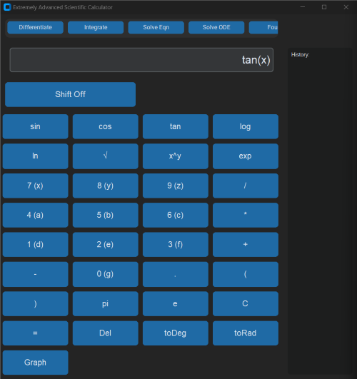
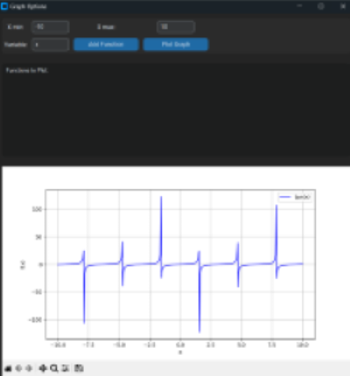

# Scientific Calculator with Graphing and Advanced UI

This repository contains a Python-based scientific calculator application featuring a modern, dark-themed interface built using [CustomTkinter](https://github.com/TomSchimansky/CustomTkinter). It supports evaluation of complex mathematical expressions, dynamic function graphing, custom shift mapping for digit buttons, and full keyboard input support.

## Features

- **Modern UI**: A sleek, dark-themed interface built with CustomTkinter.
- **Mathematical Evaluation**: Supports arithmetic operations, trigonometric functions (`sin`, `cos`, `tan`), logarithms (`log`, `ln`), exponentiation, square roots, and more.
- **Graphing Capabilities**: Dynamically plot functions (e.g., polynomials, trigonometric functions, exponentials) using Matplotlib.
- **Shift Mapping**: Digit buttons display an extra character (e.g., `7 (x)`) for shift mode. When shift is toggled on, pressing a digit inserts the corresponding letter instead.
- **Keyboard Input Support**: Use your keyboard to input expressions. Special keys:
  - **Enter**: Evaluate the expression.
  - **Backspace**: Delete the last character.
  - **Escape**: Clear the current expression.
- **Dynamic Graph Options**: Specify the x-axis range and variable to plot the graph for any valid mathematical function.

- 

## Installation

Ensure you have Python 3.x installed, then install the required packages:

```bash
pip install customtkinter mpmath numpy matplotlib sympy
```

## Usage

1. **Clone the Repository:**

   ```bash
   git clone https://github.com/Optimized-Brain/scientific-calculator.git
   cd scientific-calculator
   ```

2. **Run the Application:**

   ```bash
   python calculator.py
   ```

3. **Using the Calculator:**

   - **Buttons:** Click on the on-screen buttons to build your expression. For digit buttons, the displayed text shows both the digit and its shift-mapped letter (e.g., `7 (x)`).
   - **Shift Mode:** Toggle shift mode by clicking the "Shift On/Shift Off" button. When activated, pressing a digit will insert its mapped letter.
   - **Keyboard Support:** You can also type on your keyboard:
     - **Enter**: Evaluates the current expression.
     - **Backspace**: Deletes the last character.
     - **Escape**: Clears the expression.

4. **Graphing Functions:**

   - Build your function expression (e.g., `tan(x)`, `x**2 + 3*x + 2`, `sin(x)`).
   - Click the **Graph** button or "ctrl+g" command.
   - In the graph options window, set:
     - **X min / X max:** The range for the x-axis.
     - **Variable:** The variable in your expression (default is `x`).
   - Click **Plot Graph** to display the function's graph.

  

## Contributing

Contributions are welcome! Feel free to open an issue or submit a pull request if you have improvements, bug fixes, or new features.

## License

This project is licensed under the MIT License. See the [LICENSE](LICENSE) file for details.

---
